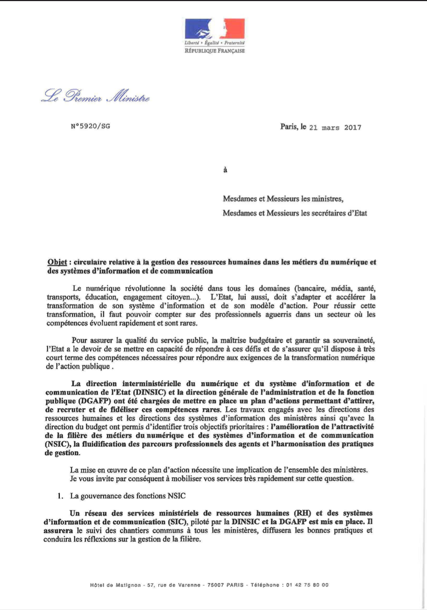
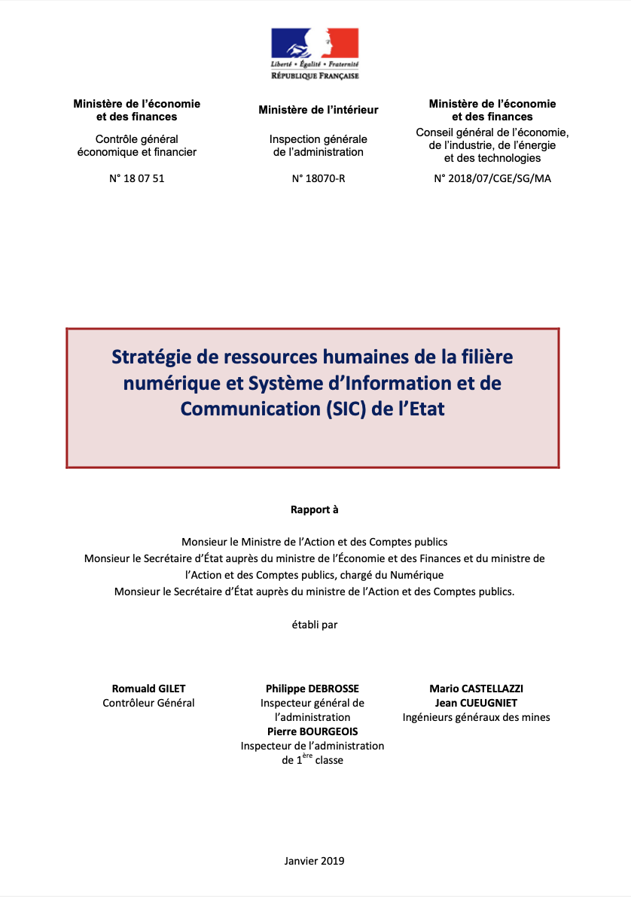
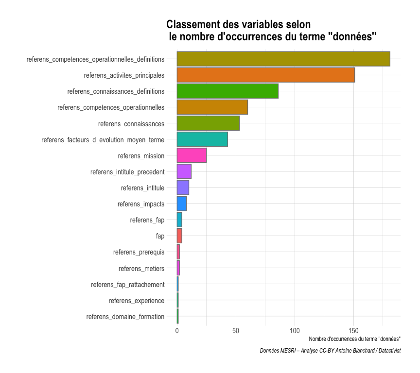
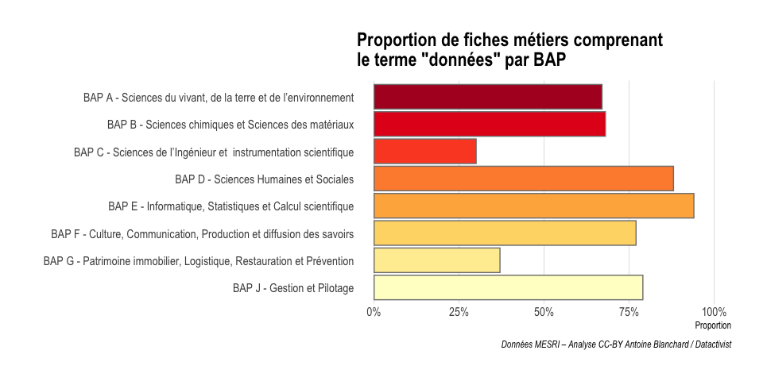
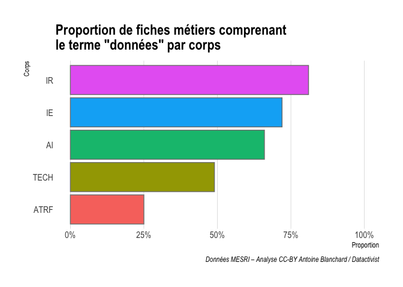
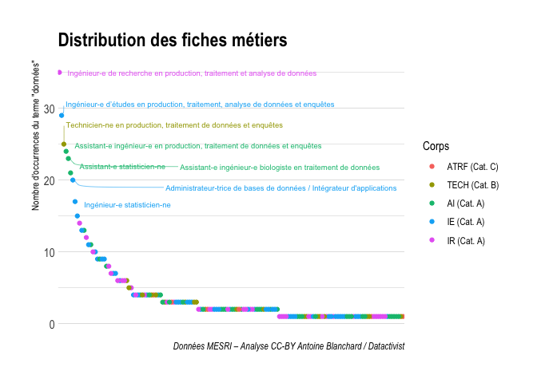

layout: true

`r paste0("<div class='my-footer'><span>", params$event, "</span> <center><div class=logo><a href='https://datactivist.coop/'></a></div></center></span></div>")`

---

```{r , include=FALSE}
load("../analyse_referens/my_workspace.RData")
library(DT, quietly = TRUE)
```

class: center, middle

Ces slides en ligne : `r paste0("http://datactivist.coop/", params$slug)`

Sources : `r paste0("https://github.com/datactivist/", params$slug)`


Diaporama librement réutilisable selon les termes de la licence [Creative Commons 4.0 BY-SA](https://creativecommons.org/licenses/by-sa/4.0/legalcode.fr).

<br />
<br />


---
## Place des données dans la stratégie des universités

L'analyse de plusieurs schémas directeurs numériques fait apparaître sept enjeux de la donnée :
- données de la recherche
- innovation pédagogique (*learning analytics*)
- formation et sensibilisation
- cohérence du SI
- pilotage par la donnée
- datacenter
- open data

Les données apparaissent donc comme une composante du patrimoine informationnel des universités (où elles sont présentées comme étant à protéger et à valoriser), sous-tendu par des infrastructures (qui seraient à développer) et des processus de gestion (qui seraient à moderniser) qui rendent possibles des usages institutionnels, notamment à des fins de pilotage (qui seraient à diffuser et à accompagner).

---

## Une stratégie de la donnée appuyée sur des métiers et compétences spécifiques

Mettre en œuvre cette stratégie, dans un contexte de nouvelles pratiques issues de la LRU (2007), nécessite des profils spécialisés et compétents dans la collecte, le stockage, le traitement et l’administration des données.

--> insérer schéma Amue sur le cycle de vie de la donnée

---

## .red[2017] : une GPEEC pour la filière numérique de l'État

[](https://www.legifrance.gouv.fr/download/pdf/circ?id=41952)
.right-column[Cette circulaire du Premier ministre charge la DINSIC et la DGAFP « de mettre en place un plan d’action permettant d’attirer, de recruter et de fidéliser ces compétences rares » à travers la réalisation d’une gestion prévisionnelle des emplois et des compétences (GPEEC) interministérielle et la construction d’un référentiel de rémunération par métier SIC pour éviter toute politique de concurrence entre ministères.]

---

## .red[janvier 2019] : une attention portée au métier de datascientist

[](https://www.economie.gouv.fr/files/files/directions_services/cgefi/Rapport-strategie-RH-filiere-numerique-SIC-CGEFI_CGEIE_IGA_janvier-2019.pdf)
.right-column[Ce rapport met en évidence 13 métiers en tension au sein de l’État dans la filière du numérique et des systèmes d’information et de communication (NSIC). Parmi ceux-ci, un métier apparaît comme « critique », « affichant un besoin total en 2020 de 1,6 fois le nombre d’agents actuellement en poste » : il s’agit du **métier de *data scientist*, à la fois considéré comme « rare » et « stratégique »**.]

---

## .red[2020] : un coup de semonce

[](https://www.gouvernement.fr/sites/default/files/contenu/piece-jointe/2020/12/rapport_-_pour_une_politique_publique_de_la_donnee_-_23.12.2020__0.pdf)
.right-column[La Mission Bothorel s'attarde sur les « compétences disponibles pour mettre en œuvre [la] politique » de la donnée et des codes sources de l’État. Elle rappelle notamment que **la GPEEC interministérielle spécifique à la filière NSIC « n’a pas réellement démarré, faute de priorisation suffisante »**.

Elle cite en annexe le *Digital, Data and Technology Profession Capability Framework* du service interministériel britannique des projets numériques, le *Government Digital Service*, afin « d’aider les organisations du secteur public à mieux comprendre et recruter les professionnels de la donnée et de constituer un groupe d’agents publics disposant de connaissances sur ces sujets ». **Ce cadre de référence  met en avant plusieurs métiers : *data scientist*, mais aussi *data analyst*, *data engineer*, et *performance analyst***.]

---
class:center,inverse, middle

# Désormais réputées autonomes, où en sont les universités dans leur management des métiers et compétences de la donnée ? 

---
class:center,inverse, middle

# Les métiers de la donnée vus par les emplois-types RéFérens

.footnote[Blanchard A., Wenden B. (2021). Analyse statistique des emplois-types RéFérens relatifs à la donnée, R, version 1.0, http://doi.org/10.5281/zenodo.4730582]
---

## À propos de RéFérens

RéFérens est le répertoire des branches d’activités professionnelles et des emplois-types des ingénieurs et personnels techniques de recherche et de formation des universités (ITRF) et des ingénieurs et personnels techniques de recherche du CNRS (ITA) – soit plus de 70% des personnels BIATSS titulaires en 2018.

Il comprend **242 emplois-types, 8 branches d’activités professionnelles (BAP), 35 familles d’activités professionnelles (FAP), et 5 corps** :
- ATRF = adjoint technique
- TECH = technicien
- AI = assistant ingénieur
- IE = ingénieur d'études
- IR = ingénieur de recherche

---

## .red[La donnée], une compétence opérationnelle et une activité principale



???

Comme on pouvait s’y attendre, le terme données apparaît le plus dans les champs qui décrivent les compétences opérationnelles (rang 1) et les activités principales (rang 2) des fiches métiers. Il apparaît assez peu dans l’intitulé des fiches métiers, qui est au 9e rang. Au 6e rang, donc assez haut, on trouve le champ “Facteurs d’évolution à moyen terme” du métier qui vise, selon la documentation de RéFérens, à identifier les facteurs clés et en déduire leur impact qualitatif sur le métier.

---

## .red[La donnée], facteur majeur d'évolution à moyen terme des emplois-types

“données” est le troisième terme le plus fréquent dans le champ “Facteurs d’évolution à moyen terme” des fiches métiers.


|racine      |occurrences      |
|--------- |------:|
| développ | 108   |
|  gestion | 45    |
| **donné** | **43**|
|   evolut | 36    |
| techniqu | 34    |
| numériqu |  30   |
|   nouvel | 26    |
| recherch | 26    |

???

Ce qui conforte notre analyse sur l’importance de la donnée dans le développement de l’université et des compétences de ses agents.

Etonnamment, aucune fiche métier de la BAP J ne considére la donnée pour son évolution moyen terme. Pourtant, les entretiens que nous avons menés montrent que le domaine du pilotage est fortement amené à évoluer dans le contexte de la donnée.

---

## .red[La donnée], dénominateur commun des BAP D et E



???

L’étude des branches d’activités professionnelles montre que les BAP E Informatique, statistiques et calcul scientifique et BAP D Sciences humaines et sociales possèdent en proportion la plus grande part de métiers liés aux données. Par ailleurs, les BAP A, B et C qui concernent le soutien à la recherche sont moins concernées par les données que les BAP F et J qui sont liés à l’administration de l’université.

---

## .red[La donnée] progresse avec le niveau d'emploi




---

## 154 fiches métiers contiennent le terme "données"


???

On regarde la concentration du terme données par fiche métier.

---

## 13 métiers de la donnée

Les fiches métiers où le terme apparaît le plus (≥ 17 fois), sinon dans l’intitulé, forment une liste de 13 "métiers de la donnée”.

```{r eval=require('DT'), tidy=FALSE, echo=FALSE}
DT::datatable(
  metiers_donnee,
  fillContainer = FALSE, options = list(pageLength = 2))
```
